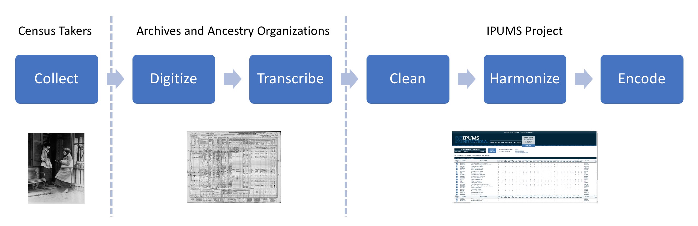
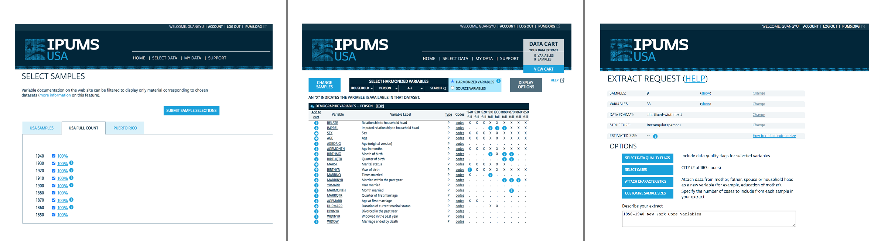

# Data Sources

```{r setup, include=FALSE}
knitr::opts_chunk$set(warning = FALSE, message = FALSE, echo = TRUE)
knitr::write_bib("knitr", file = "packages.bib")
## Tidyverse
# install.packages("dplyr")
# install.packages("ggplot2")
# install.packages("stringr")
# install.packages("purrr")
## HTML tables
# install.packages("DT")
## Importing libraries
library(ipumsr) 
library(tidyverse) 
```

## Introduction of Data Source

IPUMS is acronym for "Integrated Public Use Microdata Series", one of the world's largest microdata database. It collects censuses and surveys around the world and throughout time, documents them thoroughly, and hosts the datasets in standardized formats for research and public access.

In this project, we use IPUMS USA^[Steven Ruggles, Sarah Flood, Sophia Foster, Ronald Goeken, Jose Pacas, Megan Schouweiler and Matthew Sobek. IPUMS USA: Version 11.0 [dataset]. Minneapolis, MN: IPUMS, 2021. 
https://doi.org/10.18128/D010.V11.0], which is part of the database that covers United States population using decennial census records. The whole database for IPUMS USA contains 191,983,898 historical person records for the year 1850 to 1940, and 180,755,919 unique person records for censuses after 1940. Though our analysis is focused on the NYC population during its important transition period at the turn of 20th century, the methodology and code we developed and open-sourced can be easily generalized to the analysis of modern day census data as well as for other geographical areas. 

## Data Generation Process

```{r echo=FALSE, fig.cap="Data Generation Process", out.width = '100%'}

```
The data were originally collected by census takers, who were recruited and trained by the Census Bureau to go door to door and collect the demographic information. The raw entry are logged on sheets of paper and stored in archives across the country. With recent development and wide-spread of digitization technology, many of the census records are scanned and digitized. Furthermore, volunteers and commercial teams have been transcribing the records based on the digital scans to convert the record into a fully machine-readable format. National archive and organization like Ancestry Library have taken on such transcription effort. Finally, the IPUMS project, along with many partners in the area, clean the transcribed data, harmonize the variables across different years, and encode the data in a standard coding system for efficient storage and retrieval. We are able to analyze the data we have today thanks to the awe-inspiring work of all the parties involved in this long journey of data generation process. 

## Data Extraction Workflow

```{r echo=FALSE, fig.cap="Data Extraction Workflow", out.width = '100%'}

```
The whole IPUMS USA database is huge, so we need to create an extract based on the scope of our project. The first step is to select samples, which specifies from which year and what percentage of datasets to extract. Second step is to select variables, which are indexed by topical and alphabetical order. Finally, we add a filter based on city variable to limit the scope to NYC, since the data for the whole country is more than 70 GB and not relevant to our project.

## Choice of Variables

We choose the variables based on 3 criteria: relevancy, availability, usability. We first identify 57 variables that describe demographic data and / or contain information about working condition and job opportunity (relevancy). Then, we keep 33 variables that are recorded in multiple census years in our scope (availability). Finally, we shortlist 25 variables that are well-documented and have low missing value rate (usability). Among these variables, 7 are numerical variables, 16 are categorical (nominal) variables, the other two are temporal (year) and spatial (city), respectively.  

There are 333,959 records in the dataset we analyze, which is an one-percent random sample of the full-count data. The full-count data is larger than the RAM of our computer thus we conduct sampling, but the code and analysis is applicable to the full-count given more computing power. 

## Issues with the Data

The IPUMS USA database is systematically cleaned and edited, thus most data quality issues are dealt with and marked with data quality flags. For our specific use case, we have encountered two data issues. First, some categorical fields have very infrequent entries that are not relevant to our analysis. In other words, the categorization are too detailed and add little to our faceted visualizations. Second, variables like occupations and industries have a high cardinality and the frequencies of each value are about evenly distributed. For these variables, we need to cluster values into meaningful groups to make comprehensible graphs. These two data issues are addressed in the next chapter - data cleaning.

